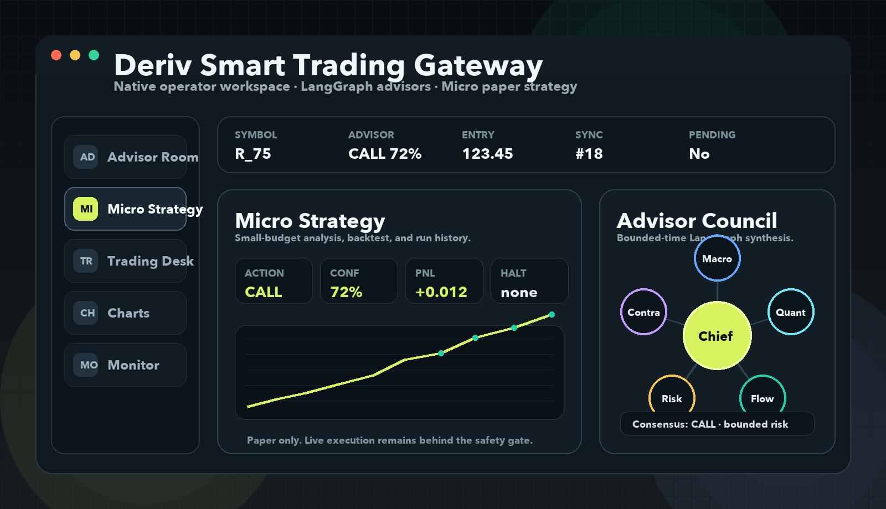

# Deriv Smart Trading Gateway

An AI-native trading gateway for Deriv that combines a React operator workspace, a streaming FastAPI gateway, a native desktop shell, a FastMCP tool server, a LangGraph-powered advisor council, and a fast micro-strategy engine for short-horizon decision support.



## What It Is

Deriv Smart Trading Gateway turns natural-language trading intent into a coordinated multi-agent workflow. It can read live Deriv market data, build candle snapshots, simulate trades, review risk, and prepare execution through a human-confirmed safety gate.

The newest layer is the **Boss Advisor Room**: a LangGraph council where multiple advisor agents read market context, optional web research, and short-horizon signals before producing one clear `CALL`, `PUT`, or `WAIT` recommendation.

The workflow is now anchored by persistent **Trade Cases**. A single case follows the operator goal through advisor review, market validation, micro backtesting, risk review, human confirmation, execution, and post-trade review. Every transition has a version number and an append-only audit event, so page changes and concurrent agent updates do not silently overwrite one another.

The primary browser workspace now uses **React + Vite** with a **FastAPI Server-Sent Events (SSE)** backend. Model output arrives as real provider stream chunks, while agent starts, finishes, tool calls, routes, and errors are delivered on the same live event channel. Streamlit remains available as a compatibility console for legacy modules.

## Technology Stack

| Layer | Technology | Why It Is Used |
| --- | --- | --- |
| Agent orchestration | LangGraph | Models trading work as an explicit state graph instead of a single prompt. This makes routing, guardrails, memory, and tests easier to control. |
| Tool server | FastMCP | Exposes Deriv market and execution tools to MCP-compatible clients while keeping tool boundaries explicit. |
| Market data | Deriv WebSocket API | Provides live ticks, candle history, account checks, proposals, buys, open-contract status, and close-contract flows. |
| Strategy engine | Python + pandas | Keeps numerical work deterministic: EMA, momentum, volatility, cost edge, confidence, paper PnL, and circuit breakers. |
| AI providers | OpenAI-compatible chat API, DeepSeek, Anthropic, local rules | Lets every agent run with configurable prompts and provider choice instead of being locked to one model. |
| Streaming API | FastAPI + SSE | Delivers tool activity, sub-agent progress, and model tokens incrementally instead of waiting for the complete response. |
| Persistence | SQLite | Stores local run history, advisor results, micro-strategy runs, trade receipts, audit logs, and agent memory without requiring a remote database. |
| Charts | Plotly | Renders candlesticks, moving averages, advisor overlays, zoom, measurement, and exportable chart views. |
| Operator UI | React + TypeScript + Vite | Provides a responsive, dense operator workspace with streaming chat, agent activity, live market snapshots, strategy evidence, and health monitoring. |
| Compatibility UI | Streamlit | Keeps the original multi-page console available while modules migrate to the modern frontend. |
| Desktop shell | PySide6 | Provides a native app surface, background behavior, and tray-style operator workflow. |
| Validation | pytest, smoke tests, browser checks | Covers parsing, prompts, LangGraph compilation, safety gates, persistence, market tools, and UI rendering. |

## Design Philosophy

The system is intentionally not an "AI says buy, then buys" demo. The architecture separates reasoning, calculation, safety, and execution:

- LLM agents reason, debate, summarize, and coordinate work.
- Deterministic Python code calculates prices, indicators, budgets, and circuit breakers.
- LangGraph controls which agent can run next and blocks execution before unsafe nodes are called.
- SQLite keeps a local audit trail so the operator can reopen the app and continue from recent context.
- Human confirmation remains the final write gate before any Deriv order submission.

This makes the project closer to a controlled AI operations system than a single chatbot.

## Highlights

- **LangGraph trading team runtime** with supervisor routing, graph nodes, handoff-style routing, guardrails, shared state, and per-agent memory.
- **Parallel routed-agent execution** so independent market, strategy, risk, compliance, and report work does not accumulate serial model latency.
- **Persistent run tracing** with a run ID, per-agent latency, partial-failure isolation, cancellation state, restart recovery, and a refresh-safe operator ledger.
- **Unified live event stream** for tool calls, agent starts/completions, errors, routes, and token-by-token manager output.
- **Markdown decision answers** with safe rendering for headings, lists, tables, code, and evidence blocks.
- **Local conversation browser** with automatic titles, previews, message counts, and one-click context restoration from SQLite.
- **Performance-conscious motion system** for route transitions, agent activity, live status, market-line drawing, and responsive operator feedback.
- **Persistent Trade Case state machine** that connects advisor, chart, micro-strategy, risk, confirmation, execution, and review artifacts under one case ID.
- **One-click full simulation** that runs advisor review, live market validation, micro backtesting, and a deterministic consistency gate, then stops before human confirmation.
- **Operator decision brief** that turns persisted advisor, candle, budget, backtest, and risk evidence into one plain-language decision, supporting metrics, and a concrete next action.
- **Recoverable workflow checkpoints** that preserve the failed step and reuse completed evidence when the operator retries a case.
- **Concurrency-safe synchronization** through SQLite transactions, WAL mode, optimistic version checks, and append-only case events.
- **LangGraph advisor council** with independent advisor nodes, merged graph state, and a chief synthesizer.
- **Extensible agent prompts** through `agent_prompts.json`, including manager, execution workers, and advisor personas.
- **Deriv WebSocket tools** for ticks, historical candles, account checks, simulated trades, open-contract status, and close-contract flows.
- **Natural-language command center** for Chinese and English trading prompts.
- **Human-in-the-loop execution gates** so write actions require explicit confirmation before Deriv order submission.
- **Live-account protection** that blocks live trading unless both UI and backend explicitly allow it.
- **Multi-symbol charting** for synthetic indices, jump indices, boom/crash, and forex symbols such as `R_100`, `R_75`, `BOOM1000`, and `frxEURUSD`.
- **Market-data integrity checks** that flag duplicate timestamps, out-of-order candles, invalid OHLC ranges, stale data, and possible feed gaps before an operator trusts a chart.
- **Advisor evaluation loop** that marks recent advisor calls against latest price and 1m/5m/10m candle horizons for paper accuracy and return tracking.
- **Multi-page operator workspace** that separates the advisor room, trading desk, charts, and system monitor.
- **Global status strip** for symbol, latest advisor stance, entry reference, API calls, sync version, and pending-trade state.
- **Chart-linked advisor overlays** that draw the latest matching advisor entry reference directly on candlestick charts.
- **Trading-desk safety panel** that makes token, human-confirmation, live-execution, and pending-order state visible before execution.
- **Native desktop shell** through PySide6 with system health, background tray behavior, and micro-strategy analysis.
- **Micro trading strategy engine** for small, frequent paper-trade decisions using momentum, EMA separation, volatility, cost edge, and risk limits.
- **Paper trading workbench** for the micro strategy module with persisted strategy runs, budget checks, trade logs, win rate, PnL, equity, and circuit-breaker halts.
- **Advisor-to-trade draft bridge** that can turn a `CALL` or `PUT` advisor result into a pending trade draft without submitting an order.
- **Audit export** for the current decision chain, excluding API tokens.
- **Local audit trail** for team runs, advisor decisions, role dialogue, API traces, and trade receipts.
- **Smoke and pytest coverage** for agent configuration, symbol parsing, LangGraph compilation, advisor runtime, and safety gates.

## Architecture

```text
User / Boss
  |
  v
React Operator Workspace / Native Desktop App / Streamlit Compatibility Console
  |
  +--> FastAPI SSE Gateway
  |      session memory -> agent events -> provider token stream -> browser
  |
  +--> Trade Case State Machine
  |      objective -> advisor -> market -> backtest -> risk -> confirm -> execute -> review
  |      SQLite versioning + append-only audit events
  |
  +--> LangGraph Advisor Council
  |      web_research -> market_snapshot -> news_signal -> advisor_* -> synthesize
  |
  +--> Micro Strategy Engine
  |      recent prices -> momentum/EMA/volatility/cost checks -> CALL/PUT/WAIT or BUY/SELL/HOLD
  |
  +--> LangGraph Trading Team
  |      supervisor -> routed worker nodes -> guardrails -> report
  |
  v
FastMCP Deriv Tool Server
  |
  v
Deriv WebSocket API
```

## Repository Layout

```text
.
├── agent_prompts.json              # Editable prompt registry for manager, workers, and advisors
├── agent_streaming.py              # Provider streaming, per-agent calls, routing, and chat memory
├── advisor_evaluation.py           # Paper evaluation logic for advisor outcomes and horizons
├── case_workflow.py                # One-click workflow order, consistency gate, and retry checkpoints
├── desktop_app.py                  # Native PySide6 desktop shell
├── desktop_packaging_requirements.txt # Optional PyInstaller dependency set
├── desktop_requirements.txt        # Optional desktop UI dependency set
├── docs/assets/                    # README and project media
├── frontend/                       # React + TypeScript + Vite operator workspace
├── gateway_api.py                  # FastAPI REST/SSE gateway and frontend host
├── mcp_config.json                 # MCP client configuration
├── micro_trading.py                # Small-trade strategy analysis engine
├── packaging/pyinstaller/          # Desktop app packaging spec
├── paper_trading.py                # Paper-trading backtest and circuit-breaker utilities
├── requirements.txt                # Python dependencies
├── scripts/build_desktop_app.sh     # macOS desktop build helper
├── scripts/run_modern_app.sh        # Build and launch the modern operator workspace
├── server.py                       # FastMCP server with Deriv WebSocket tools
├── smoke_test.py                   # End-to-end runtime smoke checks
├── tests/                          # Pytest coverage for parsing, safety, prompts, and LangGraph
├── trade_cases.py                  # Persistent workflow state machine and audit events
└── web_app.py                      # Streamlit operator UI and multi-agent runtime
```

## Native Desktop App

The native desktop app is the intended long-term operator surface. It does not require opening a browser and can keep running in the background through the system tray when the platform supports it.

Run it directly:

```bash
cd deriv-smart-trading-gateway
python3 -m venv .venv
.venv/bin/pip install -r requirements.txt
.venv/bin/pip install -r desktop_requirements.txt
.venv/bin/python desktop_app.py
```

On macOS you can double-click:

```text
Deriv Desktop.command
```

Current desktop modules:

- **Monitor**: local DB, LangGraph, token, pending-trade, and freshness health checks.
- **Micro Strategy**: quick small-trade analysis from recent closes for Deriv, funds, equities, crypto, or forex-style instruments. This module has its own small-budget guard and does not change the general trading desk behavior.
- **Background**: close-to-tray behavior where supported.

Build a macOS desktop app bundle:

```bash
cd deriv-smart-trading-gateway
scripts/build_desktop_app.sh
open "dist/Deriv Smart Trading Gateway.app"
```

The build script installs the regular runtime, desktop UI dependencies, and PyInstaller packaging dependencies into `.venv`, then creates a local app bundle under `dist/`.

## Modern Operator Workspace

Start the current primary UI:

```bash
cd deriv-smart-trading-gateway
python3 -m venv .venv
.venv/bin/pip install -r requirements.txt
scripts/run_modern_app.sh
```

Open:

```text
http://127.0.0.1:8765
```

On macOS, `Deriv Gateway.command` performs the same dependency check, frontend build, browser open, and FastAPI launch.

The workspace includes:

- **Command Center**: persistent conversations, true streaming model output, and live sub-agent activity.
- **Conversation History**: reopen earlier local sessions without losing their stored context; empty sessions stay out of the history list.
- **Trade Cases**: create persisted tasks, bind one to a manager conversation, and watch advisor, market, risk, workflow, version, and audit evidence synchronize back over the live SSE stream. Chat analysis never creates an order draft or bypasses human confirmation.
- **Advisor Team**: the active agent roster and each agent's independent prompt.
- **Markets**: selectable Deriv symbols, live Tick data, 60 one-minute closes, and an uncropped responsive trend chart.
- **Micro Strategy**: strict per-trade budget, plain-language action, confidence, signal evidence, paper backtest, and circuit-breaker result.
- **System Monitor**: FastAPI, SSE, SQLite, agent registry, provider, and frontend-build health.
- **Run Ledger**: recent multi-agent runs, status, symbol, model, successful/degraded agent counts, and end-to-end latency persisted in SQLite.

For remote model providers, each routed sub-agent is called separately and concurrently with its own prompt. The manager waits for the complete evidence set, then streams the final synthesis token by token. API keys stay in the current browser memory and request only; they are not persisted to SQLite.

## Quality Gate

Run the same compile, test, frontend build, API health, and SSE smoke checks used by CI:

```bash
scripts/quality_gate.sh
```

Python runtime versions are captured in `requirements-lock.txt`, while the React workspace is reproduced with `frontend/package-lock.json` and `npm ci`. GitHub Actions runs the gate on every push and pull request.

## Streamlit Compatibility Console

The Streamlit UI remains available as a full operator console and is organized into focused pages:

- **Trade Cases**: create and resume end-to-end tasks, inspect synchronized artifacts, control task state, and review the audit timeline.
- **Advisor Room**: advisor council, source review, transcripts, and paper evaluation.
- **Micro Strategy**: standalone small-budget strategy lab with budget checks, paper trading, and circuit breakers.
- **Trading Desk**: natural-language trading manager, direct agent dispatch, and execution log.
- **Charts**: candle snapshots, comparison overlays, measurement, data export, and latest ticks.
- **Monitor**: live agent graph, agent roster, sync bus, and API trace.

The console uses a terminal-style module navigator with clear route cards for each page. The active module is highlighted, while the global status strip stays visible above every workspace so critical state is not hidden during page switches.

Every page shares one global status strip so the operator can see current symbol, latest advisor stance, entry reference, API call count, sync version, and pending-trade state without switching context.

The Trading Desk also surfaces the execution safety gate as a compact panel, while Charts can overlay the latest matching advisor reference price on the active candlestick view.

### End-to-End Trade Case Flow

1. Open **Trade Cases**, enter the objective and symbol, then create the case.
2. Choose **Run Full Simulation** to execute advisor review, market validation, and the micro-strategy paper backtest in sequence. The manual **Continue Next Step** route remains available for inspecting each module separately.
3. The consistency gate verifies symbol alignment, fresh and structurally valid candles, an actionable advisor and strategy direction, paper-trade evidence, budget limits, circuit breakers, and a non-live order draft.
4. If evidence conflicts or a risk limit trips, the case remains blocked with plain-language reasons and no pending order is created.
5. If a technical step fails, its checkpoint is stored. **Retry From Failure** resumes at that step instead of repeating completed work.
6. A passing simulation creates only a pending paper-trade draft and stops at the human-confirmation gate. It never submits an order automatically.
7. After explicit confirmation, a successful receipt completes the case and preserves the full event timeline for review.

Cases can be paused, resumed, cancelled, or retried. Paused and terminal cases reject new agent artifacts, preventing background work from mutating a task the operator has stopped.

The task page rebuilds its decision brief directly from SQLite, so advisor direction, latest validated price, candle count, strategy direction, budget result, paper win rate, PnL, circuit-breaker reason, and retry point survive page changes and application restarts. Pending confirmations intentionally do not survive a restart: the UI marks the old draft as expired and asks the operator to rerun validation against fresh market data.

## Micro Strategy And Paper Trading

The micro strategy module is separate from the main trading desk. It can analyze recent closes, apply a small-budget guard, run paper-trading backtests, persist recent strategy runs, and halt simulations through circuit breakers such as consecutive losses, total loss, drawdown, or trade-count limits.

This module is intentionally non-executing by default. It produces analysis, paper results, and risk context; it does not bypass the trading desk, human confirmation, or MCP execution safety model.

## Streamlit Compatibility Quick Start

```bash
cd deriv-smart-trading-gateway
python3 -m venv .venv
.venv/bin/pip install -r requirements.txt
.venv/bin/streamlit run web_app.py --server.port 8501
```

Open the app:

```text
http://localhost:8501
```

The Streamlit console remains available at port `8501`, but `Deriv Gateway.command` now launches the modern React/FastAPI workspace on port `8765`.

## Run The MCP Server

```bash
cd deriv-smart-trading-gateway
.venv/bin/python server.py
```

Available MCP tools:

- `get_market_ticks`
- `get_historical_candles`
- `execute_simulated_trade`
- `check_account_status`
- `get_open_contract_status`
- `close_open_contract`

## Agent System

The app uses two complementary agent systems.

**Execution Team**

- A LangGraph supervisor builds a route for each user request instead of blindly running every worker.
- Strategy, Market, Risk, Compliance, Chart, Execution, and Report are separate graph nodes with their own prompts and memory.
- Every node writes to shared graph state, the UI timeline, and its own short-term session memory.
- Guardrails keep incomplete or unsafe trade requests away from the Execution Trader.
- Execution Trader is still the only worker allowed to submit Deriv write operations, and it remains blocked by token, demo/live, and human-confirmation gates.

**Advisor Council**

- Macro Advisor reads external catalysts and broad risk tone.
- Quant Advisor focuses on short-window momentum and moving averages.
- Flow Advisor watches rhythm, volatility, and execution windows.
- Risk Advisor challenges overconfident trades.
- Contrarian Advisor attacks the consensus before the chief advisor synthesizes the final view.

When `langgraph` is installed, both the trading team and advisor council run as graphs. If LangGraph is unavailable, the app falls back to local runners so the UI remains usable.

The current architecture follows the same broad patterns used by strong open-source multi-agent projects:

- **LangGraph Swarm / Supervisor style**: route control through graph state and handoff-like node transitions.
- **OpenAI Agents SDK style**: agents have instructions, tools, guardrails, human-in-the-loop boundaries, and traceable runs.
- **CrewAI style**: agents have roles, goals, tools, process, and memory.
- **AutoGen style**: worker agents can collaborate through shared conversation context rather than one monolithic prompt.

The practical result is that a vague request such as `帮我买r100` is routed to Strategy, Risk, Compliance, and Report, then asks for missing amount/direction. A complete request such as `用 1 美金买 R_100 看涨 5 ticks` enters the full Strategy -> Market -> Risk -> Compliance -> Execution -> Report chain.

## Extend Agents

All core prompts live in:

```text
agent_prompts.json
```

Add a new advisor by creating an `advisor.<id>` entry:

```json
{
  "advisor.breakout": {
    "name": "Breakout Advisor",
    "prompt": "Only evaluate breakout and failed-breakout setups. Always include confirmation price, invalidation level, and whether to wait."
  }
}
```

The UI automatically creates a matching LangGraph advisor node for custom advisor prompts. The reserved `advisor.chief` prompt controls the final synthesizer.

To add a new execution worker, add its prompt first, then register the corresponding tool or node in `web_app.py`.

## Advisor Evaluation

The advisor council now records an entry reference price with each recommendation. From the UI, the operator can mark recent advisor decisions against the latest available price and recent one-minute candle horizons, then inspect:

- direction accuracy for `CALL` and `PUT` recommendations
- paper return percentage for directional calls
- `WAIT` quality when the market remains inside a small movement threshold
- 1m, 5m, and 10m horizon scores after the advisor decision
- per-run outcome, confidence, entry price, mark price, and question

This is intentionally paper evaluation only. It does not place trades or imply real execution quality, but it creates the feedback loop needed before trusting advisor behavior.

## Safety Model

The gateway is designed to keep execution explicit:

- In the React workspace, API keys remain only in browser memory long enough to make the local request; FastAPI does not persist them.
- In the compatibility console, API keys remain only in Streamlit session state.
- Missing token, missing amount, missing direction, or unclear trade intent blocks execution.
- Deriv write actions require human confirmation from the UI.
- Demo accounts are supported by default.
- Live-account execution is blocked unless `allow_live=true` is explicitly provided by both UI and backend paths.
- Advisor recommendations never bypass the execution safety gate.

## Local Data

The app stores run history and audit records in a local SQLite database:

```text
local_data/gateway.sqlite3
```

The database is created automatically on first run. You do not need a remote account or cloud database for local persistence.

Stored records include:

- `chat_sessions` and `chat_messages`: modern workspace conversations, assistant answers, provider metadata, and per-session context.

- `team_runs`: user prompt, final manager answer, agent event timeline, market report, execution report, and execution log.
- `advisor_runs`: advisor question, symbol, consensus, confidence, full result JSON, and paper-evaluation context.
- `micro_strategy_runs`: small-trade strategy goal, symbol, action, confidence, budget result, paper PnL, trade count, and circuit-breaker state.
- `trade_receipts`: Deriv demo/live receipt metadata when an order is actually submitted.
- `agent_memory_items`: short memory summaries for manager, market, strategy, risk, compliance, chart, execution, report, and advisor agents.
- `trade_cases`: objective, symbol, current status, workflow stage, synchronization version, artifact context, and last error.
- `trade_case_events`: append-only task history containing actor, stage, status, version, message, and structured payload.

On app startup, the workspace hydrates from SQLite:

- the latest trading-desk prompt and answer are restored into the chat area;
- the latest execution log and agent timeline are restored;
- the latest advisor result is restored as the active advisor context;
- recent advisor, team, and micro-strategy runs appear in the sidebar and page tables;
- per-agent memory is restored so agents do not start from a completely blank context.
- the latest active, paused, or failed Trade Case is restored so the workflow can continue after restarting the app.

For safety, some values are intentionally not persisted:

- Deriv API tokens;
- model API keys;
- browser session state;
- pending trade confirmations.

Pending trade confirmations are not restored because an old pending order could become stale or unsafe. After reopening the app, the operator must re-check data freshness and confirm a new trade attempt.

If you want the app to prefill secrets without storing them in SQLite, configure local environment variables before launch:

```bash
export DERIV_API_TOKEN="your-demo-token"
export OPENAI_API_KEY="your-openai-key"
# or:
export DEEPSEEK_API_KEY="your-deepseek-key"
export ANTHROPIC_API_KEY="your-anthropic-key"
export OPENAI_COMPATIBLE_API_KEY="your-compatible-key"
export OPENAI_COMPATIBLE_BASE_URL="https://api.your-provider.com/v1"
```

The UI masks these values, and audit export still excludes them.

To reset local history, stop the app and remove the SQLite file:

```bash
rm local_data/gateway.sqlite3
```

API keys are not written to the database. They live only in the current UI session and are masked in the interface.

## Model Providers

The model selector supports:

- Local rule engine with no model API key.
- OpenAI.
- DeepSeek through the OpenAI-compatible base URL `https://api.deepseek.com`.
- Anthropic.
- Custom OpenAI-compatible providers with a configurable base URL.

## Symbol Examples

The chart and advisor workflows accept many Deriv symbols:

```text
Draw the latest 120 one-minute candles for R_100
Draw frxEURUSD 60 candles at 5m
Analyze R_75 for the next 5 minutes
Check BOOM1000 momentum before execution
```

Common symbols include:

```text
R_10, R_25, R_50, R_75, R_100
1HZ10V, 1HZ25V, 1HZ50V, 1HZ75V, 1HZ100V
BOOM500, BOOM1000, CRASH500, CRASH1000
JD10, JD25, JD50, JD75, JD100
frxEURUSD, frxGBPUSD, frxUSDJPY
```

## Validation

Run the checks:

```bash
.venv/bin/python -m py_compile gateway_api.py agent_streaming.py web_app.py server.py smoke_test.py
.venv/bin/python -m pytest -q
.venv/bin/python smoke_test.py
cd frontend && npm run build
```

Recent validation:

```text
111 passed
React production build: OK
FastAPI SSE stream: OK
dependencies: OK
prompts_and_symbols: OK
advisor_evaluation: OK
langgraph_compile: OK
micro_trading_engine: OK
budget_guard: OK
paper_trading: OK
deriv_market_tools: OK
advisor_runtime: OK
```

## Deriv Endpoint

The implementation defaults to the compatible Deriv v3 WebSocket endpoint:

```text
wss://ws.derivws.com/websockets/v3?app_id={app_id}
```

Override it with `DERIV_WS_URL_TEMPLATE` if you need a different endpoint.

## Disclaimer

This project is a local trading assistant and research gateway. It is not financial advice. Always review advisor output, risk gates, account mode, and order parameters before placing trades.
