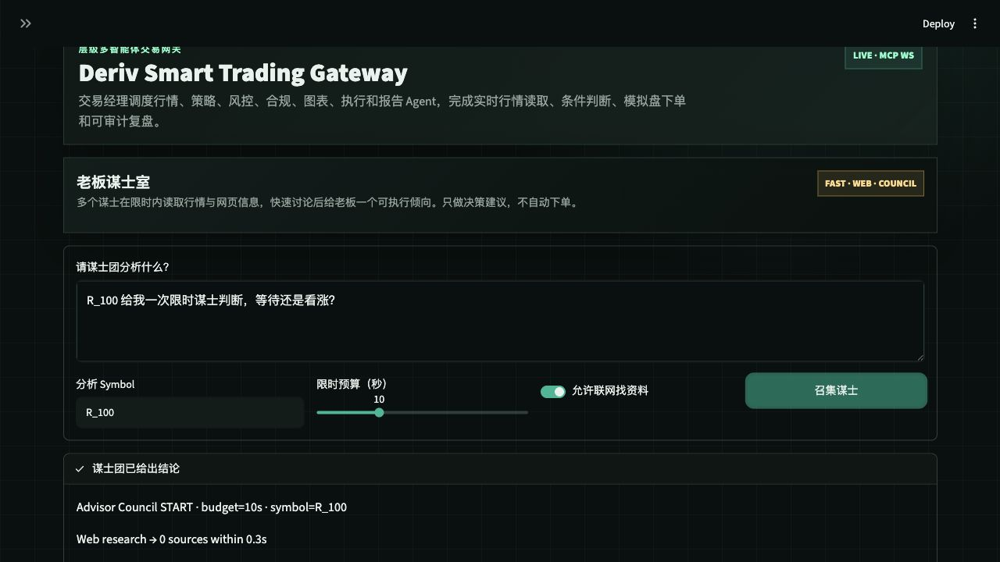

# Deriv Smart Trading Gateway

An AI-native trading gateway for Deriv that combines a native desktop shell, a FastMCP tool server, a LangGraph-powered advisor council, and a fast micro-strategy engine for short-horizon decision support.



## What It Is

Deriv Smart Trading Gateway turns natural-language trading intent into a coordinated multi-agent workflow. It can read live Deriv market data, build candle snapshots, simulate trades, review risk, and prepare execution through a human-confirmed safety gate.

The newest layer is the **Boss Advisor Room**: a LangGraph council where multiple advisor agents read market context, optional web research, and short-horizon signals before producing one clear `CALL`, `PUT`, or `WAIT` recommendation.

The project is moving toward a **native desktop operator app** with background runtime support. Streamlit remains available as an operator console, while LangGraph handles agent orchestration and FastMCP exposes the Deriv tool layer for MCP-compatible clients.

## Highlights

- **LangGraph advisor council** with independent advisor nodes, merged graph state, and a chief synthesizer.
- **Extensible agent prompts** through `agent_prompts.json`, including manager, execution workers, and advisor personas.
- **Deriv WebSocket tools** for ticks, historical candles, account checks, simulated trades, open-contract status, and close-contract flows.
- **Natural-language command center** for Chinese and English trading prompts.
- **Human-in-the-loop execution gates** so write actions require explicit confirmation before Deriv order submission.
- **Live-account protection** that blocks live trading unless both UI and backend explicitly allow it.
- **Multi-symbol charting** for synthetic indices, jump indices, boom/crash, and forex symbols such as `R_100`, `R_75`, `BOOM1000`, and `frxEURUSD`.
- **Advisor evaluation loop** that marks recent advisor calls against latest price and 1m/5m/10m candle horizons for paper accuracy and return tracking.
- **Multi-page operator workspace** that separates the advisor room, trading desk, charts, and system monitor.
- **Global status strip** for symbol, latest advisor stance, entry reference, API calls, sync version, and pending-trade state.
- **Chart-linked advisor overlays** that draw the latest matching advisor entry reference directly on candlestick charts.
- **Trading-desk safety panel** that makes token, human-confirmation, live-execution, and pending-order state visible before execution.
- **Native desktop shell** through PySide6 with system health, background tray behavior, and micro-strategy analysis.
- **Micro trading strategy engine** for small, frequent paper-trade decisions using momentum, EMA separation, volatility, cost edge, and risk limits.
- **Advisor-to-trade draft bridge** that can turn a `CALL` or `PUT` advisor result into a pending trade draft without submitting an order.
- **Audit export** for the current decision chain, excluding API tokens.
- **Local audit trail** for team runs, advisor decisions, role dialogue, API traces, and trade receipts.
- **Smoke and pytest coverage** for agent configuration, symbol parsing, LangGraph compilation, advisor runtime, and safety gates.

## Architecture

```text
User / Boss
  |
  v
Native Desktop Operator App / Streamlit Console
  |
  +--> LangGraph Advisor Council
  |      web_research -> market_snapshot -> news_signal -> advisor_* -> synthesize
  |
  +--> Micro Strategy Engine
  |      recent prices -> momentum/EMA/volatility/cost checks -> CALL/PUT/WAIT or BUY/SELL/HOLD
  |
  +--> Hierarchical Execution Team
  |      manager -> market / strategy / chart / risk / compliance / execution / report
  |
  v
FastMCP Deriv Tool Server
  |
  v
Deriv WebSocket API
```

## Repository Layout

```text
.
├── agent_prompts.json              # Editable prompt registry for manager, workers, and advisors
├── advisor_evaluation.py           # Paper evaluation logic for advisor outcomes and horizons
├── desktop_app.py                  # Native PySide6 desktop shell
├── desktop_requirements.txt        # Optional desktop UI dependency set
├── docs/assets/                    # README and project media
├── mcp_config.json                 # MCP client configuration
├── micro_trading.py                # Small-trade strategy analysis engine
├── requirements.txt                # Python dependencies
├── server.py                       # FastMCP server with Deriv WebSocket tools
├── smoke_test.py                   # End-to-end runtime smoke checks
├── tests/                          # Pytest coverage for parsing, safety, prompts, and LangGraph
└── web_app.py                      # Streamlit operator UI and multi-agent runtime
```

## Native Desktop App

The native desktop app is the intended long-term operator surface. It does not require opening a browser and can keep running in the background through the system tray when the platform supports it.

Run it directly:

```bash
cd /Users/wangkeyu/Documents/项目
python3 -m venv .venv
.venv/bin/pip install -r requirements.txt
.venv/bin/pip install -r desktop_requirements.txt
.venv/bin/python desktop_app.py
```

On macOS you can double-click:

```text
/Users/wangkeyu/Documents/项目/Deriv Desktop.command
```

Current desktop modules:

- **Monitor**: local DB, LangGraph, token, pending-trade, and freshness health checks.
- **Micro Strategy**: quick small-trade analysis from recent closes for Deriv, funds, equities, crypto, or forex-style instruments. This module has its own small-budget guard and does not change the general trading desk behavior.
- **Background**: close-to-tray behavior where supported.

## Streamlit Operator Console

The Streamlit UI remains available as a full operator console and is organized into focused pages:

- **Advisor Room**: advisor council, source review, transcripts, and paper evaluation.
- **Trading Desk**: natural-language trading manager, direct agent dispatch, and execution log.
- **Charts**: candle snapshots, comparison overlays, measurement, data export, and latest ticks.
- **Monitor**: live agent graph, agent roster, sync bus, and API trace.

The console uses a terminal-style module navigator with clear route cards for each page. The active module is highlighted, while the global status strip stays visible above every workspace so critical state is not hidden during page switches.

Every page shares one global status strip so the operator can see current symbol, latest advisor stance, entry reference, API call count, sync version, and pending-trade state without switching context.

The Trading Desk also surfaces the execution safety gate as a compact panel, while Charts can overlay the latest matching advisor reference price on the active candlestick view.

## Streamlit Quick Start

```bash
cd /Users/wangkeyu/Documents/项目
python3 -m venv .venv
.venv/bin/pip install -r requirements.txt
.venv/bin/streamlit run web_app.py --server.port 8501
```

Open the app:

```text
http://localhost:8501
```

On macOS you can also double-click:

```text
/Users/wangkeyu/Documents/项目/Deriv Gateway.command
```

The launcher creates `.venv` if needed, installs dependencies, and opens the Streamlit app.

## Run The MCP Server

```bash
cd /Users/wangkeyu/Documents/项目
.venv/bin/python server.py
```

Available MCP tools:

- `get_market_ticks`
- `get_historical_candles`
- `execute_simulated_trade`
- `check_account_status`
- `get_open_contract_status`
- `close_open_contract`

## Agent System

The app uses two complementary agent systems.

**Execution Team**

- Trading Manager decomposes the boss request and dispatches work.
- Market Analyst, Strategy Researcher, Chart Engineer, and Report Agent gather context and produce artifacts.
- Risk Sentinel and Compliance Reviewer block unsafe or incomplete trade requests.
- Execution Trader is the only worker allowed to submit Deriv write operations.

**Advisor Council**

- Macro Advisor reads external catalysts and broad risk tone.
- Quant Advisor focuses on short-window momentum and moving averages.
- Flow Advisor watches rhythm, volatility, and execution windows.
- Risk Advisor challenges overconfident trades.
- Contrarian Advisor attacks the consensus before the chief advisor synthesizes the final view.

When `langgraph` is installed, each advisor runs as a graph node. If LangGraph is unavailable, the app falls back to a local council runner so the UI remains usable.

## Extend Agents

All core prompts live in:

```text
agent_prompts.json
```

Add a new advisor by creating an `advisor.<id>` entry:

```json
{
  "advisor.breakout": {
    "name": "Breakout Advisor",
    "prompt": "Only evaluate breakout and failed-breakout setups. Always include confirmation price, invalidation level, and whether to wait."
  }
}
```

The UI automatically creates a matching LangGraph advisor node for custom advisor prompts. The reserved `advisor.chief` prompt controls the final synthesizer.

To add a new execution worker, add its prompt first, then register the corresponding tool or node in `web_app.py`.

## Advisor Evaluation

The advisor council now records an entry reference price with each recommendation. From the UI, the operator can mark recent advisor decisions against the latest available price and recent one-minute candle horizons, then inspect:

- direction accuracy for `CALL` and `PUT` recommendations
- paper return percentage for directional calls
- `WAIT` quality when the market remains inside a small movement threshold
- 1m, 5m, and 10m horizon scores after the advisor decision
- per-run outcome, confidence, entry price, mark price, and question

This is intentionally paper evaluation only. It does not place trades or imply real execution quality, but it creates the feedback loop needed before trusting advisor behavior.

## Safety Model

The gateway is designed to keep execution explicit:

- API keys are stored only in Streamlit session state, not hardcoded in source files.
- Missing token, missing amount, missing direction, or unclear trade intent blocks execution.
- Deriv write actions require human confirmation from the UI.
- Demo accounts are supported by default.
- Live-account execution is blocked unless `allow_live=true` is explicitly provided by both UI and backend paths.
- Advisor recommendations never bypass the execution safety gate.

## Local Data

The app stores run history and audit records in a local SQLite database:

```text
local_data/gateway.sqlite3
```

Stored records include team runs, advisor runs, role dialogue, API traces, execution logs, and trade receipts. API keys are not written to this database.

## Model Providers

The model selector supports:

- Local rule engine with no model API key.
- OpenAI.
- DeepSeek through the OpenAI-compatible base URL `https://api.deepseek.com`.
- Anthropic.
- Custom OpenAI-compatible providers with a configurable base URL.

## Symbol Examples

The chart and advisor workflows accept many Deriv symbols:

```text
Draw the latest 120 one-minute candles for R_100
Draw frxEURUSD 60 candles at 5m
Analyze R_75 for the next 5 minutes
Check BOOM1000 momentum before execution
```

Common symbols include:

```text
R_10, R_25, R_50, R_75, R_100
1HZ10V, 1HZ25V, 1HZ50V, 1HZ75V, 1HZ100V
BOOM500, BOOM1000, CRASH500, CRASH1000
JD10, JD25, JD50, JD75, JD100
frxEURUSD, frxGBPUSD, frxUSDJPY
```

## Validation

Run the checks:

```bash
.venv/bin/python -m py_compile web_app.py server.py smoke_test.py
.venv/bin/python -m pytest -q
.venv/bin/python smoke_test.py
```

Recent validation:

```text
13 passed
dependencies: OK
prompts_and_symbols: OK
langgraph_compile: OK
deriv_market_tools: OK
advisor_runtime: OK
```

## Deriv Endpoint

The implementation defaults to the compatible Deriv v3 WebSocket endpoint:

```text
wss://ws.derivws.com/websockets/v3?app_id={app_id}
```

Override it with `DERIV_WS_URL_TEMPLATE` if you need a different endpoint.

## Disclaimer

This project is a local trading assistant and research gateway. It is not financial advice. Always review advisor output, risk gates, account mode, and order parameters before placing trades.
