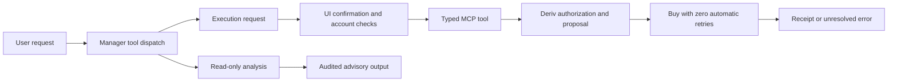

# Deriv Smart Trading Gateway

An agent orchestration prototype that turns a request into bounded tools, checks account authorization and human confirmation, and records execution outcomes.

The Streamlit workbench now has four focused areas: **Decision**, **Market**, **Orders**, and **Audit**. The decision screen shows market evidence, the final stance, source links, Jev participation and measured elapsed time. Detailed rule opinions and runtime traces stay available on demand.

## Problem

A model can produce an invalid call, a read can fail, and a timed-out write may already have succeeded. The engineering question is how to keep those failures from becoming unintended trades or misleading success reports.

## System


```mermaid
flowchart LR
  A[User request] --> B[Manager tool dispatch]
  B --> C[Read-only analysis]
  B --> D[Execution request]
  D --> E[UI confirmation and account checks]
  E --> F[Typed MCP tool]
  F --> G[Deriv authorization and proposal]
  G --> H[Buy with zero automatic retries]
  H --> I[Receipt or unresolved error]
  C --> J[Audited advisory output]
```

## Engineering decisions

- **Authorization before effects:** reject failed or unrecognized account checks; live-account writes require explicit opt-in. Invalid proposals must stop before buy.
- **Human-in-the-loop:** the Streamlit execution path stages the exact order parameters for confirmation by default. A changed order returns to the pending state. This is a UI policy, configurable by the operator; direct MCP clients must enforce their own approval boundary. The backend does not cryptographically prove human consent.
- **Write timeout behavior:** buy requests use zero automatic retries. An ambiguous outcome requires account/contract reconciliation before another write.
- **Advisory isolation:** advisor output does not itself execute trades. A transient graph-node failure can fall back to the local advisory flow; persistent component failure is not guaranteed to recover.
- **Inspectable orchestration:** prompt registry, dispatch names, API traces and receipts are available for review. Advisor count is not a quality metric.

## Optional Jev live decision

Enable **Jev live decisions** in the Streamlit sidebar and enter a TypeSafe API key. After each advisor run gathers a new market snapshot, Jev receives a small, explicit state: the question, symbol, latest Tick and candle trend metrics, and up to three dated news headlines. It returns a typed `CALL / PUT / WAIT` Choice with the full probability distribution. The Jev opinion appears as its own advisor card and in the downloadable JSON. A valid Jev response replaces the slow final language-model synthesis for that run.

Jev's opinion affects the published stance. A high-confidence `CALL` or `PUT` can promote a local `WAIT` only when the measured candle trend supports the same direction; `WAIT` can hold back a directional local consensus. A conflict between Jev and a directional local consensus, weak model confidence, missing or stale Tick data, or an unsupported trend results in `WAIT`. Tick timestamps older than 30 seconds are rejected when provided. The app shows the selected option probability and model confidence separately from the local rule vote share. These values are not a calibrated probability of trading profit.

The local "advisor" perspectives are deterministic rules, not five independent language models. The graph passes the selected Jev and optional language-model settings into worker nodes explicitly. Web research and the market snapshot run in parallel, and network calls have shorter per-step caps so unavailable feeds return a `WAIT` result promptly. An optional language model can add an explanation; it does not overwrite the evidence-gated stance.

The existing bounded Jev fast/deep router also applies to explicit read-only market/chart commands in the manager console. Trading requests never enter that fast path. Jev uses TypeSafe's documented [`/v1/systemone` Choice API](https://docs.typesafe.ai/api) with a 1.2-second request cap and no automatic retry. Errors or timeouts preserve the prior advisory path. Its API key stays in the current Streamlit session. Jev does not generate prose, supply order parameters, approve trades, or bypass account checks and confirmation. End-to-end speed improvement still requires a real key and representative latency measurements.

## Failure evidence and tests

The audit found the UI recorded an unsuccessful account lookup without returning before execution. This revision blocks that path and unknown account types. The dispatcher also rejects non-object/missing-required-field model calls before invoking a worker.

```bash
python3.12 -m venv .venv
source .venv/bin/activate
python -m pip install -r requirements.txt
python -m pytest tests -q
```

The new [failure-boundary tests](tests/test_failure_boundaries.py) inject failed authorization, invalid symbol/proposal responses, buy timeouts, malformed manager arguments and a transient advisor-node error. Existing [safety tests](tests/test_safety_gates.py) cover missing token, confirmation and blocked live accounts. These tests use fake transport and do not place external trades.

The [failure and validation record](docs/failures/account-and-dependency-boundaries.md) preserves the clean-install MCP 2.x collection failure and compatible dependency constraint. The current suite uses fake transport and never places an external trade.

## Trade-offs and limitations

The manager still relies on backend schemas for full argument validation. Unknown/non-object calls are rejected, but this is not a complete adversarial model-output evaluation. A JSON parsing failure may trigger the existing deterministic manager fallback. Human approval is not bound to an immutable, signed order at the MCP boundary.

A no-retry write avoids automatic duplication but leaves ambiguous outcomes unresolved; there is no durable reconciliation queue. Local traces are inspectable records, not externally attested immutable logs. No trading profitability, model-selection advantage, production availability or real-account test result is claimed.

## Run and inspect

```bash
streamlit run web_app.py
```

Use [configuration and operation details](OPERATIONS.md) for providers and tool examples. [server.py](server.py) owns typed transport tools; [web_app.py](web_app.py) owns orchestration and UI confirmation; [agent_prompts.json](agent_prompts.json) records prompts. The expanded feature catalog remains in the operation guide.

AI tools assisted implementation and this audit's tests/documentation. Passing tests verifies these controls under the recorded cases; developer review owns acceptance of the execution policy and remaining boundaries.
