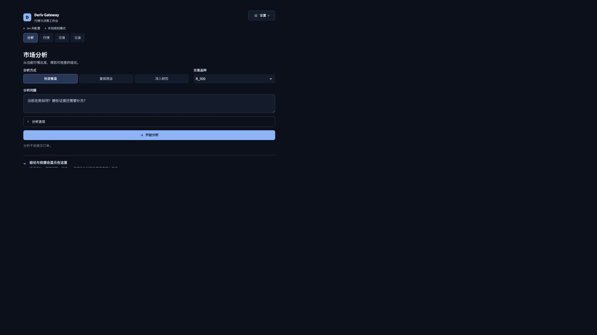

# Deriv Smart Trading Gateway

本地 Deriv 行情、只读分析与明确确认的交易工作台。Python 3.12 + Streamlit + LangGraph + FastMCP + SQLite。

- **分析**：确定性证据检查 + Jev `finish / deep / wait`，按需解释。
- **观察**：UP / DOWN / FLAT / UNKNOWN，与 CALL / PUT 交易指令分开。
- **执行**：统一 TradingService → RiskEngine → OrderEngine → DerivAdapter。
- **恢复**：持久订单、幂等认领、参数绑定确认、UNKNOWN 对账和启动恢复。
- **界面**：保留深蓝灰工作台，分析、行情、交易、记录四个入口。



## 结构与操作

[项目结构与设计思路](docs/project-architecture.md) · [操作指南](OPERATIONS.md) · [七阶段改造记录](docs/execution-refactor.md) · [Jev 场景设计](docs/jev-scenario-design.md)


```mermaid
flowchart LR
    U[Streamlit / MCP / Manager 草稿] --> T[TradingService]
    T --> A[持久 Approval]
    A --> R[Deterministic RiskEngine]
    R --> O[OrderEngine / SQLite 原子认领]
    O --> D[DerivAdapter / 零写重试]
    D --> C[回执或 UNKNOWN]
    C --> X[Reconciler 只读核对]
```

## 启动

```bash
python3.12 -m venv .venv
.venv/bin/python -m pip install -r requirements.txt
.venv/bin/streamlit run web_app.py --server.port 8511
# 外部 MCP 客户端使用的独立入口
.venv/bin/python server.py
```

在工作台右上角配置 Jev、可选解释模型和 Deriv Token。公开行情无需 Token。默认 Jev 固定 `jev-1.13.0`，也可在启动前提供 `TYPESAFE_API_KEY`。

## 订单边界

每个逻辑订单使用稳定 intent_id。同一个订单只有一个进程能认领提交；网络超时不重新 buy。已尝试发送但结果不确定时进入 UNKNOWN，并核对经纪商记录。无法唯一关联成交时保持 UNKNOWN。

确认记录绑定完整参数和实际授权账户，默认十分钟有效。MCP 没有批准工具，demo 与 live 均需要本地确认。live 还要求主机 `DERIV_LIVE_WRITES_ENABLED=1`；MCP 额外要求 `DERIV_MCP_LIVE_WRITES_ENABLED=1`。`allow_live=True` 单独无效。

全局 HALTED/REDUCE_ONLY 拒绝新 BUY，已确认平仓可以减少敞口。默认风险限额及配置说明见操作指南。Streamlit 和 MCP 必须使用同一 SQLite 文件才能共享幂等与风险预留。

## 检查

```bash
.venv/bin/python -m pytest -q --disable-warnings --tb=short --show-capture=no
.venv/bin/python scripts/evaluate_jev.py --output local_data/jev-offline-replay.json
```

2026-10-02：181 项测试通过，包括成交后超时、重复请求、进程退出恢复、审批金额变更、并发资金预留、HALTED、MCP 绕过，以及本轮新增的回执冲突、迟到对账、卖出结果缺失和损益分页检查。测试使用假网络，不执行外部订单；复审记录见[执行核心改造记录](docs/execution-refactor.md#2026-10-02-执行核心复审)。

Jev 对照评估提供路由正确性、WAIT 分类、deep 使用、失败率、延迟、usage 和成本字段。离线 Jev 使用模拟答案；它不证明模型准确率、实际速度或交易盈利。真实评估使用显式 `--live`，需要密钥，0.8/0.7 门槛标为 UNCALIBRATED_THRESHOLD。
