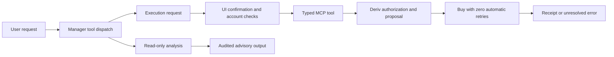

# Deriv Smart Trading Gateway

An agent orchestration prototype that turns a request into bounded tools, checks account authorization and human confirmation, and records execution outcomes.

The Streamlit workbench uses a compact graphite and blue interface with shared widget, chart and result styles. Settings live in the header, advanced analysis controls are collapsed, and the workspace has four focused areas: **Analysis**, **Market**, **Orders**, and **History**. Analysis shows market evidence, the final stance, source links, Jev participation and measured elapsed time. Detailed rule opinions and runtime traces stay available on demand.

Question drafts and analysis settings survive workspace changes. After submission, the question stays available for another fresh read. History opens the saved evidence, reasoning path and JSON export, and can reuse the question and settings without starting a new request. Results show their snapshot time and describe evidence quality at the time of analysis. The status indicator receives progress while Jev and the explanation model are running, including the transition to deeper explanation.


## Problem

A model can produce an invalid call, a read can fail, and a timed-out write may already have succeeded. The engineering question is how to keep those failures from becoming unintended trades or misleading success reports.

## System


```mermaid
flowchart LR
  A[User request] --> B[Manager tool dispatch]
  B --> C[Read-only analysis]
  B --> D[Execution request]
  D --> E[UI confirmation and account checks]
  E --> F[Typed MCP tool]
  F --> G[Deriv authorization and proposal]
  G --> H[Buy with zero automatic retries]
  H --> I[Receipt or unresolved error]
  C --> J[Audited advisory output]
```

## Engineering decisions

- **Authorization before effects:** reject failed or unrecognized account checks; live-account writes require explicit opt-in. Invalid proposals must stop before buy.
- **Human-in-the-loop:** the Streamlit execution path stages the exact order parameters for confirmation by default. A changed order returns to the pending state. This is a UI policy, configurable by the operator; direct MCP clients must enforce their own approval boundary. The backend does not cryptographically prove human consent.
- **Write timeout behavior:** buy requests use zero automatic retries. An ambiguous outcome requires account/contract reconciliation before another write.
- **Advisory isolation:** advisor output does not itself execute trades. A graph-node failure returns WAIT without repeating network or model calls. If LangGraph is unavailable, the local flow uses the same evidence policy and time budget.
- **Inspectable orchestration:** prompt registry, dispatch names, API traces and receipts are available for review. Advisor count is not a quality metric.

## Jev scenario controller

The Analysis workspace supports **Observe**, **Review** and **Research**. Jev participates in the actual control flow: a single batched request assesses observed direction and selects `finish / deep / wait`; thesis review adds a separate consistency question. A `deep` response invokes the configured explanation model within the same deadline. Missing configuration, timeout and incomplete evidence are shown explicitly.

Open **Settings** in the upper right and enable Jev, enter a TypeSafe key (or set `TYPESAFE_API_KEY` before starting), and optionally configure an explanation model. The default is pinned to `jev-1.13.0`; each result records the actual model version, prompt/policy version, probabilities, usage, evidence ID and stage timings. Credentials stay outside graph state and saved results.

Synthetic indices such as R_100 skip external news and keep the final stance at WAIT: this project has no validated predictive strategy for them. Forex CALL/PUT describes an observed historical window, not the next tick or a contract's profitability. Fresh timestamped ticks and valid contiguous candles are required. Model confidence and rule agreement are not profit probabilities.

See the [research and scenario design](docs/jev-scenario-design.md) for official sources, exact thresholds, failure behavior and evaluation limits.

```bash
.venv/bin/python scripts/evaluate_jev.py --output local_data/jev-offline-replay.json
# Optional: real model calls on synthetic fixtures, requires TYPESAFE_API_KEY
.venv/bin/python scripts/evaluate_jev.py --live --output local_data/jev-live-eval.json
```

Offline replay checks policy behavior using mocked answers; it is not a model accuracy or speed benchmark. Jev and explanation calls have total network deadlines and no retries. The manager console retains its separate read-only fast/deep router. Order authorization remains in the existing deterministic account and confirmation checks.

## Failure evidence and tests

The audit found the UI recorded an unsuccessful account lookup without returning before execution. This revision blocks that path and unknown account types. The dispatcher also rejects non-object/missing-required-field model calls before invoking a worker.

```bash
python3.12 -m venv .venv
source .venv/bin/activate
python -m pip install -r requirements.txt
python -m pytest tests -q
```

The new [failure-boundary tests](tests/test_failure_boundaries.py) inject failed authorization, invalid symbol/proposal responses, buy timeouts, malformed manager arguments and a transient advisor-node error. Existing [safety tests](tests/test_safety_gates.py) cover missing token, confirmation and blocked live accounts. These tests use fake transport and do not place external trades.

The [failure and validation record](docs/failures/account-and-dependency-boundaries.md) preserves the clean-install MCP 2.x collection failure and compatible dependency constraint. The current suite uses fake transport and never places an external trade.

## Trade-offs and limitations

The manager still relies on backend schemas for full argument validation. Unknown/non-object calls are rejected, but this is not a complete adversarial model-output evaluation. A JSON parsing failure may trigger the existing deterministic manager fallback. Human approval is not bound to an immutable, signed order at the MCP boundary.

A no-retry write avoids automatic duplication but leaves ambiguous outcomes unresolved; there is no durable reconciliation queue. Local traces are inspectable records, not externally attested immutable logs. No trading profitability, model-selection advantage, production availability or real-account test result is claimed.

## Run and inspect

```bash
streamlit run web_app.py
```

Use [configuration and operation details](OPERATIONS.md) for providers and tool examples. [server.py](server.py) owns typed transport tools; [web_app.py](web_app.py) owns orchestration and UI confirmation; [agent_prompts.json](agent_prompts.json) records prompts. The expanded feature catalog remains in the operation guide.

AI tools assisted implementation and this audit's tests/documentation. Passing tests verifies these controls under the recorded cases; developer review owns acceptance of the execution policy and remaining boundaries.
