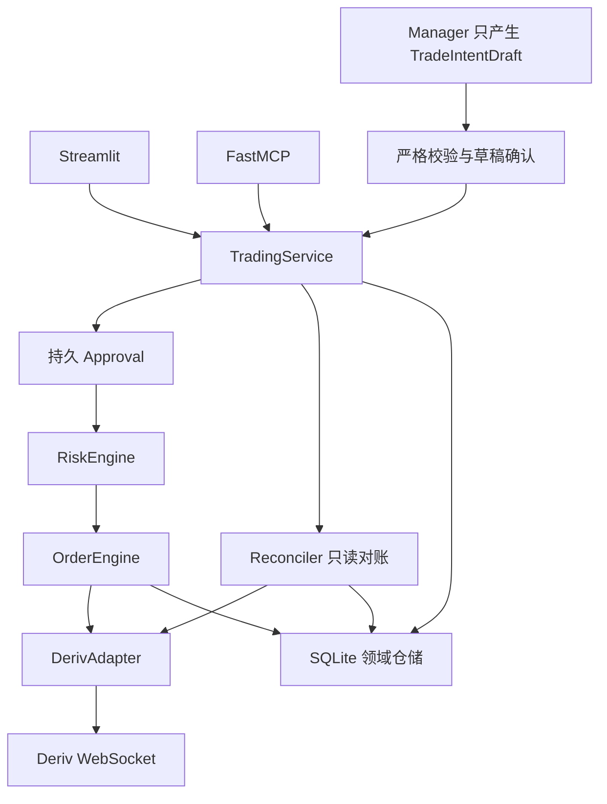
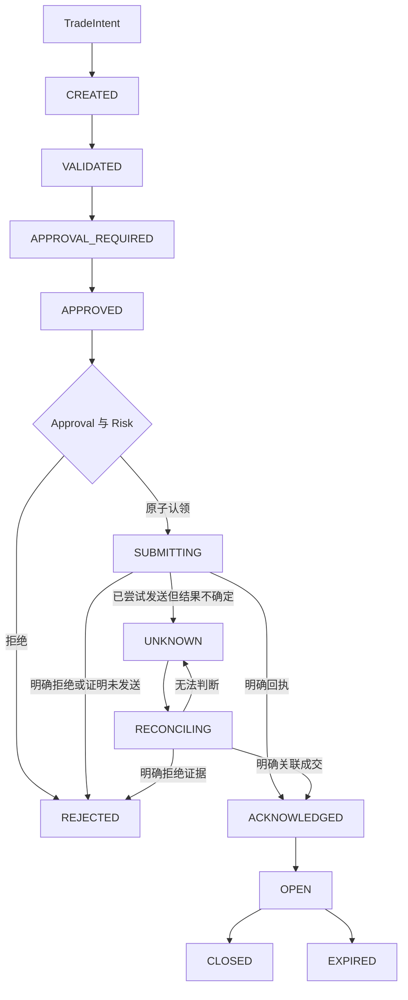

# Deriv Gateway：项目结构与设计思路

更新日期：2026-10-02。基于 `30f34bd` 完成七阶段执行核心重构及后续复审；分支 `codex/jev-scenario-controller`。阶段过程与测试记录见 [执行核心改造记录](execution-refactor.md)。

## 1. 产品目标与当前范围

这是 Python 本地行情与交易工作台。Streamlit 提供分析、行情、交易和历史记录；FastMCP 向外部客户端开放工具。界面仍使用原有深蓝灰、冷蓝主题，没有改为 React/FastAPI，也没有引入微服务、消息队列或自动交易策略。

当前有两条独立主流程：

- **只读分析**：读取证据，执行确定性检查，由 Jev 选择 `finish / deep / wait`；按需调用解释模型。
- **交易执行**：用户或 Manager 提出明确意图，持久化订单，绑定确认，执行确定性风控，通过唯一执行核心提交并核对结果。

历史窗口观察使用 `ObservedTrend.UP / DOWN / FLAT / UNKNOWN`。`CALL / PUT` 仅用于交易意图、订单和策略信号，观察不会自动转换成交易信号。当前分析的兼容 `stance` 保持 `WAIT`。

## 2. 依赖方向



业务模型不依赖 Streamlit 或 Deriv JSON。RiskEngine 不依赖模型输出、网络或数据库。交易服务通过 Adapter 获取业务对象；WebSocket、`req_id`、认证、错误与供应商字段由适配层处理。

## 3. 目录职责

```text
web_app.py                    页面、会话状态、现有分析图、只读角色兼容入口
server.py                     FastMCP 参数边界与 TradingService 调用
advisory_policy.py            行情时效、连续性、场景与观察策略
jev_router.py                 限时 Jev Choice 协议
agent_prompts.json            提示词登记，不创建独立模型实例

domain/
  trade.py                    TradeIntentDraft、TradeIntent、TradeSignal、枚举
  order.py                    Order、OrderEvent、OrderStatus
  approval.py                 参数与账户绑定的 Approval
  market.py                   ObservedTrend、EvidenceCheck、MarketSnapshot
  risk.py                     RiskResult、RiskSnapshot、TradingState
services/
  trading_service.py          创建、校验、确认、执行、平仓、查询、恢复
  context.py                  request_id、UTC 时间、monotonic deadline
  startup.py                  无密钥启动时扫描并排队异常订单
  analysis_service.py         确定性 EvidenceCheck
execution/
  engine.py                   原子认领、唯一写入、ACK/UNKNOWN 分流
  reconciler.py               只读对账、租约和进程退出恢复
risk/
  engine.py                   纯函数风险决策
  policy.py                   默认限额与主机配置
  models.py                   领域风险类型导出
adapters/deriv/
  base.py                     可替换 DerivAdapter Protocol
  models.py                   AccountSnapshot、Proposal、ContractSnapshot 等
  websocket.py                业务接口到 Deriv 请求的转换
  client.py                   WebSocket、认证、req_id、零写重试
ai/manager.py                 草稿工具、异步模型调用
strategies/base.py            最小 Strategy 接口，无自动交易策略
persistence/
  database.py                 SQLite 事务与升级入口
  migrations.py               additive schema migration
  repositories.py             不可变意图、状态迁移、事件、唯一回执

evals/                        人工行情场景和评估指标
scripts/evaluate_jev.py        四种路由的离线/真实模型对照
tests/                        现有回归及故障注入
ui/theme.css                  公共组件样式
.streamlit/config.toml        Streamlit 主题
local_data/gateway.sqlite3    本地运行数据，不提交到 Git
```

保留大部分分析和页面代码在 `web_app.py`，优先抽出资金写入边界。没有为目录齐全而搬迁全部函数。

## 4. 运行入口与共享状态

| 模式 | 启动方式 | 数据与确认 |
| --- | --- | --- |
| 工作台 | `streamlit run web_app.py --server.port 8511` | 直接调用 Python 服务；浏览器交互保存在会话 |
| MCP | 客户端启动 `python server.py`，默认 stdio | 使用同一 TradingService，不能自行批准订单 |
| 两者同时 | 独立进程分别启动 | 默认共享仓库内 SQLite；`DERIV_DB_PATH` 可指定共同路径 |

跨进程幂等、Approval、HALTED、风险预留和恢复依赖**同一个数据库文件**。不同数据库的实例不会互相去重。密钥仍由工作台会话或 MCP 工具参数提供，不写入订单库。代码不自动加载 `.env`。

## 5. 交易意图与确认

TradeIntent 表示用户想做什么，包含 `intent_id`、BUY/SELL、品种、方向、Decimal 金额、期限、demo/live、来源、UTC 创建时间及请求关联标识。严格校验禁止额外字段、布尔期限、非法方向和非有限金额；当前金额精度最多两位小数。SELL 必须指定 `contract_id`，没有方向。

意图一经保存不能改参数。相同 `intent_id` 携带不同金额、期限或账户会被拒绝；等值 Decimal（10、10.0、10.00）使用相同指纹。

Approval 保存确认的意图、授权账户、金额、方向、期限、账户模式、合约 ID、指纹、批准者及有效时间。默认十分钟有效，提交认领前再次检查。它是本地持久化的确认记录，不是经纪商签发的凭证。

工作台先展示草稿，再由用户勾选并点击“确认并提交”。模型不参与批准后的步骤。参数或 Token 变化会重新暂存并要求确认；重复草稿沿用原 intent_id。服务每次确认都比较当前参数与不可变意图，已有有效 Approval 也不能跳过比较。原订单进入提交或未知状态后，重复操作显示原状态；MCP 的重复提交仍认证账户。“新建另一笔订单”明确创建新的逻辑意图。

## 6. 订单生命周期与幂等



SELL 使用独立意图与订单，确认卖出后进入 CLOSED，并在同一事务中更新对应的本地 OPEN 买入订单，正常回执和对账确认共用这一步。不同 SELL 意图也不能并发关闭同一合约。自然结算状态可通过只读刷新核对；刷新不会覆盖并发平仓后的终态。CANCELLED 用于尚未提交订单的领域迁移；当前界面未增加取消工具。

`orders.intent_id` 和 `idempotency_key` 有 UNIQUE 约束；幂等键绑定规范化参数及实际授权账户。SQLite `BEGIN IMMEDIATE` 事务原子认领 APPROVED → SUBMITTING。只有认领者能调用 buy/sell，重复请求返回原订单。`req_id` 和 passthrough 只是请求关联信息，不是服务器端幂等键。

明确的连接失败且未进入发送操作为 NotSent；尝试发送后超时、断线或缺失回执身份为 UNKNOWN。buy/sell 在传输层强制零重试，即使调用方传入重试次数也不能改变。卖出回执必须有合约和交易标识，合约必须匹配确认目标，不能用请求中的 ID 补出成功。回执落盘失败同样转 UNKNOWN；已经持久化的成交不会被迟到异常覆盖。重复回执只保存一次；合约或交易标识与其他订单冲突时保留 UNKNOWN，不静默跳过存储。

## 7. 对账与启动恢复

Reconciler 查询授权账户、持仓、账单与合约。已知 contract_id，或能从经纪商数据明确关联 proposal/order 标识时，可确认状态。金额、品种、时间近似和空持仓列表均不是确定性证据。

官方说明 [portfolio 仅返回开放合约](https://developers.deriv.com/docs/account/portfolio/)，历史记录需要 [statement](https://developers.deriv.com/docs/account/statement/) 或 profit_table。实现不假定 Legacy 账单保存 passthrough 或 proposal_id；若关联字段不可用，UNKNOWN 会保留，工作台可由用户核对账单后显式绑定经纪商 contract_id，再进行只读检查。这不是自动重新买入。

启动扫描 SUBMITTING、UNKNOWN、RECONCILING。持久 owner_pid 与租约避免抢占另一活跃进程；原进程已经退出时立即排队，无法证明退出时等待租约到期。Streamlit 获得对应账户 Token 后尝试只读恢复；MCP 无密钥启动只扫描排队，可通过 `get_order_status(refresh=true)` 对账。无常驻后台任务，队列在启动、页面运行及显式刷新时处理。

每次对账使用独立 lease_token。旧任务的响应不能覆盖新任务或已经确认的结果；取消的读取释放租约并恢复 UNKNOWN。SELL 的目标合约自然到期不能单独证明请求卖出成功；若账单能唯一关联此次卖出，则可确认 CLOSED。已确认的合约 ID 不能被人工绑定操作改成另一合约。

对账失败保留 UNKNOWN，记录尝试和下次处理时间。UNKNOWN 会阻止同账户的新 BUY，必要的已确认平仓仍可执行。

## 8. 确定性风控

| 检查 | 默认限额 |
| --- | --- |
| 单笔金额 | 50 |
| 全部开放金额 | 200 |
| 开放合约数 | 5 |
| 同品种敞口 | 100 |
| UTC 当日已实现净亏损 | 50 |
| 连续亏损 | 3 笔 |
| 亏损后冷却 | 60 秒 |
| 可用余额下限 | 10 |
| 允许品种 | R_10/R_25/R_50/R_75/R_100、EURUSD、GBPUSD |
| 允许合约类型 | CALL、PUT |
| 最长期限 | m/h 换算后 3600 秒；Tick 合约 10 Tick |
| 每分钟提交数 | 5 |

金额单位为账户币种，不自动换汇。余额已包含经纪商扣款，只额外扣除本地尚未反映的预留金额。敞口同时计入经纪商持仓与本地未确认预留，避免并发订单分别使用同一份空持仓快照。

日亏损来自经纪商已结算 buy_price/sell_price，使用 UTC 自然日；分页读取覆盖当天与完整的尾部亏损序列，按合约去重，非有限值、负金额、冲突记录或超过 2000 条读取边界时拒绝提交。行情、账户或损益数据不可用时不提交；风险数据缺失记录 RISK_DATA_UNAVAILABLE。风险检查、全局状态读取、deadline 复核与提交认领处于同一 SQLite 写事务。

ENABLED 允许满足限额的订单，REDUCE_ONLY/HALTED 拒绝所有新 BUY，已批准的 SELL 可减少敞口。工作台提供全局停止按钮，状态持久化；普通页面 rerun 不会重置 HALTED。

`DERIV_RISK_POLICY` 指向严格 JSON 配置。RiskResult 保存 allowed、code、reason、metrics，并写 risk_events。LLM、Jev probability、confidence 和规则计数都不能放行风险判断。

## 9. MCP 与 live 边界

写入口名称为 `place_contract`，使用明确 TradingMode.DEMO/LIVE。误导性的 execute_simulated_trade 已移除，并迁移全部 Python 调用点。

MCP 工具：

- 行情：get_market_ticks、get_historical_candles。
- 账户与合约读取：check_account_status、get_open_contract_status。
- 意图与订单：create_trade_intent、get_trade_intent、get_order_status。
- 执行已批准意图：place_contract、close_open_contract。

MCP 创建意图必须提供稳定 intent_id。默认可以创建/查询意图和订单，但没有批准工具；demo 执行也需要本地持久 Approval。工作台可载入 MCP 草稿进行核对。live 还需要：

1. 意图声明 live，且 Token 对应 live 账户。
2. 有效的本地确认及风控通过。
3. 主机 `DERIV_LIVE_WRITES_ENABLED=1`。
4. MCP 额外要求 `DERIV_MCP_LIVE_WRITES_ENABLED=1`。

`allow_live=True` 不会单独授予写权限。Approval、全局状态和限额由服务检查，UI 开关不能绕过。

## 10. Jev、观察与时间预算

保留 observe/review/research 和 finish/deep/wait。Jev 不控制订单，没有增加第二层模型或更多 Agent。Choice 外形仍为原协议；观察选项改为 UP/DOWN/FLAT/UNKNOWN，版本为 scenario-v3/advisory-v3。0.8 probability 和 0.7 confidence 保留，标记 UNCALIBRATED_THRESHOLD。

MA、连续性、报价时效与品种由代码计算。确定性角色内含 EvidenceCheck；计数只是相关检查的兼容展示，不作为独立 Agent 投票或交易信号。复核方向改为 UP/DOWN，旧 SQLite 的 CALL/PUT 在读取边界映射，原记录保留。

分析共享 4–25 秒预算，Tick 最多 2.5 秒，K 线最多 3 秒，Jev 最多 1.2 秒，解释最多剩余预算且不超过 8 秒。Manager 使用 15 秒 ExecutionContext，Jev、模型与只读调用共享 monotonic deadline。业务时间、成交和持久队列使用 UTC。

资金写入进入 SUBMITTING 后不因读取预算用尽重新提交；适配层独立等待网络结果，无法确定时转 UNKNOWN。可选 sync_server_time 返回服务器时钟偏差与往返不确定度，目前不自动增加行情请求。

评估比较 Jev、纯规则、always_finish、always_deep：路由正确性、WAIT 分类正确性、无必要 deep、漏 deep、失败率、延迟分位、usage、成本。离线模拟不报告真实延迟或费用；真实模式需要密钥，费用只有提供明确价格时才估算。

## 11. 持久化与追溯

| 表 | 用途 |
| --- | --- |
| advisor_runs / team_runs / trade_receipts | 保留原历史；回执增加可空 order_id 与唯一索引 |
| execution_schema_migrations | 增量 schema 版本，升级不要求删除数据库 |
| trade_intents | 严格不可变意图及规范化 JSON |
| orders | 幂等键、状态、账户、合约、错误、租约、完整业务对象 |
| order_events | 状态变更与请求关联；SQLite 触发器禁止更新/删除 |
| order_receipts | 唯一订单回执与账户交易标识 |
| approvals | 参数与账户绑定、有效期 |
| reconciliation_jobs | 尝试数、下次处理、租约、lease_token 与进程所有者 |
| risk_events | 风险决策、指标、时间 |
| trading_control | 持久全局执行状态 |

request_id、intent_id、order_id、correlation_id 串联草稿、确认、风控、提交、对账和结果。领域对象不含原始密钥，模型配置在运行闭包中；验证错误不回显 secret 输入，执行错误只保存类型，回执只保留允许字段。

这是本地可检查记录，不是外部认证的审计系统；具有数据库文件权限的操作者仍能修改库结构。

## 12. 验证、启动与当前限制

2026-10-02 复审：完整 pytest **181 项通过**。新增 28 项用例覆盖有效审批后的参数变化、验证中断、重复提交的账户认证、异常卖出回执、成交标识冲突、落盘失败、并发平仓、取消和迟到对账，以及损益分页、去重和非法数值。

七阶段计数保留为 100、105、109、111、124、128、153（2026-10-01）；当时离线 12/12 人工场景匹配。包括真实进程退出后的即时恢复、并发资金预留、实际 Streamlit 确认提交、HALTED 不被 rerun 重置、重复消息与乱序状态、MCP 绕过、审批不匹配和未知结果对账。本轮未修改 Jev 路由。

所有交易与模型测试使用假网络，不向外部下单。此前桌面/窄屏截图为上一轮 UI 验证；本轮没有宣称重新进行真实账户或真实 Jev 联调。离线 Jev 答案是人工给定，不能与规则对照数值一起当成实测模型优势。

```bash
python3.12 -m venv .venv
.venv/bin/python -m pip install -r requirements.txt
.venv/bin/streamlit run web_app.py --server.port 8511
.venv/bin/python server.py
.venv/bin/python -m pytest -q --disable-warnings --tb=short --show-capture=no
.venv/bin/python scripts/evaluate_jev.py --output local_data/jev-offline-replay.json
.venv/bin/python scripts/print_mcp_config.py
```

未完成的扩展包括：真实 Jev 阈值校准与模型成本测量、已验证交易策略、Legacy → 新 Options API migration、常驻行情或对账任务、多机幂等及外部审计。当前保持单机共享 SQLite 和显式交易确认。
