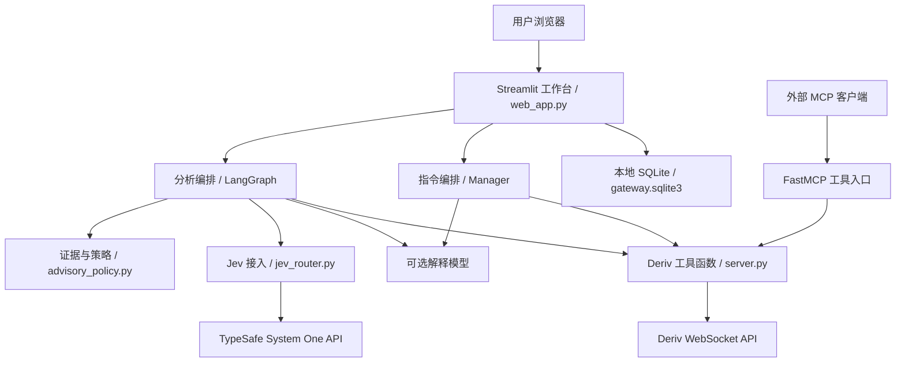
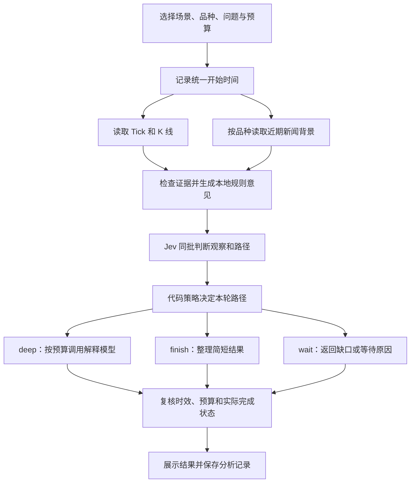
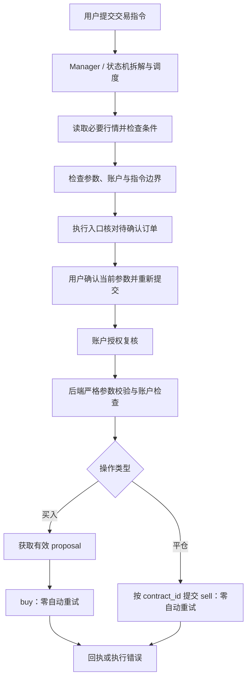

# Deriv Gateway：项目结构与设计思路

整理日期：2026-10-01。实现基线：`3c89c37`，分支 `codex/jev-scenario-controller`。

本文依据当前代码整理，面向项目维护者和后续开发者。代码中的路径以仓库根目录为起点。文中的“后续建议”尚未实现；最近的验证结果列在第 10 节。

## 1. 项目要解决什么问题

这个项目是一个本地 Deriv 行情与交易工作台。用户可以查看报价和图表、复核交易想法、按需深入分析，也可以通过自然语言提交交易指令。底层工具同时向外部 MCP 客户端开放。

本轮升级的核心问题是：模型分析耗时较长，界面配置和日志过多，用户难以快速找到结论。因此，当前设计把“读取证据”“决定要不要继续思考”“生成解释”和“执行订单”放在明确的流程中，并让页面优先展示问题、结论、依据和实际进度。

Jev 负责结构化判断和路径选择。确定性代码负责数据时效、指标计算、响应校验、时间预算和执行检查。解释模型按需补充文字。最终分析结果不会自动进入下单流程，用户需要通过独立的交易入口表达执行意图。

### 1.1 当前的两条主流程

| 流程 | 用户入口 | 主要目标 | 输出 |
| --- | --- | --- | --- |
| 行情分析 | 分析工作区 | 从当前证据得到可检查的观察；决定结束、解释或等待 | 结论、证据、Jev 判断、耗时、完整记录 |
| 指令与交易 | 交易工作区 | 理解查询或交易目标，调度工具，检查账户与订单参数 | 行情报告、待确认订单、执行回执或阻止原因 |

这两条流程共用 Deriv 工具和部分会话状态，但各有自己的控制逻辑。分析工作区的时间预算和场景控制器，目前只覆盖这一轮分析。

## 2. 总体结构与运行方式

项目以 Python 为主。Streamlit 承担页面渲染、交互状态和编排；`server.py` 提供严格类型的 Deriv 工具，既可在工作台进程内直接调用，也可作为独立 MCP 服务运行。

工作台目前没有单独的 React 前端，也没有一套供它调用的 FastAPI/REST 后端。浏览器与 Streamlit 交互，由 Python 代码调用模型和 Deriv 网络接口。



其中有两个运行入口：

- `streamlit run web_app.py`：运行用户工作台，直接调用导入的 Python 工具函数。
- `python server.py`：运行 FastMCP 服务，由 MCP 客户端按配置启动；当前入口使用默认 stdio 传输。

只使用 Streamlit 工作台时，不需要另外启动一个 MCP 服务进程。MCP 配置示例用于外部客户端接入。

| 运行模式 | 谁启动什么 | 使用方式 |
| --- | --- | --- |
| 仅工作台 | 用户启动 Streamlit，运行期间保持该进程 | 浏览器操作工作台；工具在同一 Python 进程内调用 |
| 仅 MCP | 外部客户端按配置启动 `server.py` 子进程并管理 stdio | 客户端调用六个工具；不提供工作台页面 |
| 两个入口同时使用 | Streamlit 与 MCP 客户端分别管理各自进程 | 进程独立；MCP 调用不共享工作台的确认状态，也不自动写入工作台 SQLite 记录 |

## 3. 目录与模块职责

```text
deriv-smart-trading-gateway/
├── web_app.py                   # 页面、会话状态、分析和指令编排、记录
├── server.py                    # FastMCP 工具、输入模型、Deriv WebSocket 客户端
├── jev_router.py                # Jev 请求、结构化响应校验、两类路由
├── advisory_policy.py          # 品种、数据时效、证据、场景决策策略
├── agent_prompts.json           # Manager 与各角色的提示词登记
├── requirements.txt            # Python 依赖范围
├── mcp_config.example.json      # 可移植的 MCP 客户端配置示例
├── smoke_test.py                # 含真实行情请求的连通性检查
├── .streamlit/config.toml       # Streamlit 原生主题
├── ui/
│   └── theme.css                # 页面和原生组件的公共样式
├── evals/
│   └── scenarios.py             # 人工场景、行情样本和模拟 Jev 答案
├── scripts/
│   ├── evaluate_jev.py          # 离线回放 / 显式真实模型评估
│   └── print_mcp_config.py      # 按当前目录和解释器生成 MCP 配置
├── tests/                      # 策略、工具、图流程、执行边界和 UI 回归
├── docs/
│   ├── project-architecture.md  # 本文
│   ├── jev-scenario-design.md   # Jev 研究、具体策略与验证记录
│   ├── failures/               # 已发现问题与修复证据
│   └── assets/                 # 界面截图
├── PRODUCT.md                  # 用户、产品目的和交互原则
├── DESIGN.md                   # 颜色、排版、组件和响应式约定
├── README.md                   # 项目入口说明
├── OPERATIONS.md               # 配置、工具和操作说明
└── local_data/                 # 运行时生成，不进入 Git
    └── gateway.sqlite3         # 分析、指令和回执记录
```

### 3.1 四个主要代码模块

| 模块 | 当前职责 | 维护时应关注的边界 |
| --- | --- | --- |
| `web_app.py` | 渲染四个工作区；保存交互状态；组织 LangGraph 和 Manager；调用工具；展示与持久化结果 | 页面、编排与存储仍集中在大文件中，修改时要区分两条主流程 |
| `server.py` | 校验工具参数；连接 Deriv；读取行情；账户授权；获取 proposal；买入、查询与平仓 | 执行授权在这里再次检查；buy/sell 不自动重试 |
| `jev_router.py` | 构造 TypeSafe 请求；执行限时调用；校验 Choice；返回可记录的判断对象 | 负责模型协议，不承担订单授权，也不直接写会话状态 |
| `advisory_policy.py` | 识别品种；计算证据；筛选新闻；结合场景和模型判断决定路径及方向 | 独立于 Streamlit、供应商和执行工具，便于离线验证 |

`agent_prompts.json` 保存角色名称和提示词。增加提示词条目可以改变角色登记或补充分析视角，但实际行为仍取决于 Python 函数；登记一个角色不等于增加一个独立模型实例。

`web_app.py` 还保留 `make_plan()`、`execute_plan()`、`execute_trade_closed_loop()` 等较早的兼容函数。当前主页面的指令入口使用 `run_hierarchical_trading_team()`。后续接入新入口时，需要明确所调用的执行链及其确认机制。

## 4. 前端界面的组织思路

界面采用深蓝灰背景和冷蓝操作色。按钮、输入框、选择控件、图表、结果和详情区使用同一套颜色与间距。配色来自 `.streamlit/config.toml` 和 `ui/theme.css`；Plotly 与可选 Agent 图也在代码中使用对应颜色。

| 工作区 | 默认显示 | 按需展开或进入的内容 |
| --- | --- | --- |
| 分析 | 分析方式、品种、问题、开始按钮、最新结果 | 时间预算、新闻背景、判断依据、耗时和 JSON |
| 行情 | 已加载的图表快照或加载入口 | 图表选项、对比、测量与数据导出 |
| 交易 | 指令输入、响应、实际待确认订单 | 专项工具、执行日志、交易设置 |
| 记录 | 最近分析的选择与完整结果 | 指令记录、调试信息、存储位置、Agent 结构 |

右上角“设置”集中放置 Jev、模型供应商、Deriv Token 和语言配置。用于分析解释的供应商配置，也会被指令 Manager 使用。

这套界面遵循三个使用原则：

1. **输入与结论优先。** 高级参数和原始字段放在详情中，用户先看到本轮得到了什么。
2. **重复操作少重输。** 问题、品种、复核方向、预算和新闻偏好在切换工作区后保留；提交后问题仍可再次使用。
3. **结果带时间语义。** 报价标为快照，显示 UTC+8 分析时间；证据状态使用“当时有效／当时证据不足”。历史参数复用只恢复输入，等待用户提交新一轮分析。

控件有可见的键盘焦点，窄屏按顺序排布，并尊重减少动态效果设置。图表快照通过一个选择入口切换，避免同时渲染多套重复控件。

## 5. 一轮分析如何运行

入口为 `render_advisor_council()`，执行函数为 `run_advisor_council()`。



### 5.1 获取和校验证据

LangGraph 中，行情与适用品种的新闻请求并行启动。行情分支先取 Tick，成功且仍有时间才取 K 线；分析默认读取 60 根、60 秒粒度的 K 线。

证据计算集中在 `advisory_policy.py`：

| 检查项 | 当前条件 |
| --- | --- |
| Tick 价格 | 有限、正数；不接受布尔值或数字字符串 |
| Tick 时间 | 存在有效 epoch，距当前 0–30 秒 |
| 品种 | Tick／K 线携带的品种必须与请求匹配 |
| K 线数量 | 至少 20 根 |
| K 线价格 | OHLC 有限、正数，且最高／最低关系合法 |
| K 线连续性 | 时间递增，相邻间隔约 60 秒；拒绝重复、缺口和逆序 |
| K 线时效 | 末根距当前 0–120 秒 |
| 窗口走势 | 用收盘变化与重新计算的 MA5／MA20 判断上行、下行或震荡 |
| 新闻 | 仅外汇使用；发布时间带时区，位于最近 24 小时内 |

外部输入中的 `trend` 不作为最终证据，均线和窗口走势由代码重新计算。

### 5.2 品种决定证据用途

- **外汇**：可描述已发生的观察窗口方向；近期新闻只作背景。
- **合成指数**：跳过外部新闻；最终方向保持 `WAIT`，展示价格与历史观察。本项目尚无已验证的合成指数预测策略。
- **未知品种**：保持 `WAIT`，不假定其适用外汇解释规则。

`CALL / PUT` 在分析结果中表示外汇历史窗口的观察倾向。它们没有携带订单参数，也不能证明下一 Tick 或某个合约期限的收益方向。

### 5.3 本地角色意见

新闻背景、趋势检查、价格观察、数据检查和反向复核由确定性 Python 规则生成，LangGraph 组织这些节点并汇总意见。新闻与反向视角可以保留 `WAIT`，趋势类视角依据已经校验的窗口数据。

规则票数用于解释当前规则如何形成共识。同一数据衍生的多个意见具有相关性；票数比例不能当作独立证据数量、模型正确率或盈利概率。

## 6. Jev 怎样参与思考控制

当前接入默认固定 `jev-1.13.0`，提示词版本为 `scenario-v2`，策略版本为 `advisory-v2`。设置中可显式选择 `jev-latest`，结果保存实际响应的模型版本。

Jev 接收一份紧凑状态：场景、用户问题、品种、由代码计算的证据、必要的新闻摘要、用户方向和剩余预算档位。每轮分析最多发起一次 Jev 请求，在同一批中问多个结构化问题。

### 6.1 三种场景

| 场景 | 同批问题 | 当前控制行为 |
| --- | --- | --- |
| 快速看盘 `observe` | 观察方向、`finish / deep / wait` | 有足够证据则结束；需要解释则转入模型；缺证据则等待 |
| 复核想法 `review` | 上述两题，加 `supported / contradicted / unclear` | 用户明确选择 CALL 或 PUT；复核支持、观察一致且达到门槛时才保留方向 |
| 深入研究 `research` | 观察方向、思考路径 | 有效证据下进入解释；Jev 的等待判断或代码证据检查仍可阻止继续 |

### 6.2 模型输出先校验，再进入代码策略

`jev_router.py` 要求返回完整 Choice，检查答案类型、选项集合、数值范围、概率总和、被选项是否为最大概率、confidence 和模型版本。复核场景的第三题也必须通过校验，才采用这一批判断。

当前方向和路径的初始门槛为：选项概率至少 `0.8`，confidence 至少 `0.7`。这两个数尚未用本项目真实数据校准，不代表 80% 或 70% 的交易胜率。

这里的 `0.7` 门槛只针对 Jev 返回的对应判断：方向使用 `jev_assessment.confidence`，路径使用 `path_confidence`，想法支持判断使用 `thesis_confidence`。本地规则一致度不使用这项模型门槛。

`advisory_policy.decide()` 再结合行情、品种、本地观察和场景作决定：

- 缺失或过期证据返回 `WAIT` 和等待路径。
- Jev 等待判断可以阻止方向输出和进一步解释。
- 不确定路径可以进入深入解释，同时保持 `WAIT`。
- 模型与观察方向冲突、想法未获充分支持时保持 `WAIT`。
- Jev 请求失败时，不放行已有方向；有证据和预算时允许解释失败或缺口。
- 解释模型只生成文字；最终结构化方向由代码策略控制。

记录同时保存 `requested_path` 与实际 `mode`。例如 Jev 选择了深入解释，但解释模型未配置，实际路径会变为等待，并显示原因。

### 6.3 当前控制粒度与实时反馈

当前控制粒度是**一轮任务内的阶段与模型调用**：是否结束、是否发起解释、是否等待补证据，以及各调用的时间上限。解释调用进行期间，使用网络截止时间限制整次请求；目前没有对模型内部逐 token 思考过程进行动态调节的控制器。

图节点在开始复核、完成路径判断、开始解释和解释返回时发送自定义阶段事件。`run_advisor_langgraph()` 在页面主线程消费 `updates` 与 `custom` 两类流，更新可见状态。工作节点不直接操作 Streamlit 页面；通知也不等待整次解释结束才出现。

这部分显示可检查的阶段和结果，不展示模型隐藏推理。

### 6.4 时间预算与失败处理

| 范围 | 当前限制 |
| --- | --- |
| 一轮分析 | 用户选择 4–25 秒，默认 10 秒，共享开始时间和截止时间 |
| 分析 Tick 读取 | 最多约 2.5 秒，并受剩余预算约束 |
| 分析 K 线读取 | 最多约 3 秒，并受剩余预算约束 |
| Jev 网络调用 | 最多 1.2 秒，无自动重试 |
| 解释模型 | 最多 8 秒，且必须在剩余预算内；不足 2.5 秒不开始 |

网络调用受可取消超时限制。图编译、调度和落盘可能有少量额外开销；输出记录实际耗时及 `budget_exhausted`，并在输出前复核行情时效。

图节点执行失败后返回等待或错误，不重新拉行情或重复调用模型。只有 LangGraph 依赖不可用时，才选择共享原始预算的本地分析流程。

### 6.5 指令 Manager 中的 Jev 路由

指令入口另有一套较窄的 `fast / deep` 路由。只有已配置主模型和 Jev、且请求被代码识别为明确的只读行情／图表查询时，才使用这一判断。

高置信 `fast` 选择确定性 Manager 流程，省去语言模型调度；其他情况保留原 Manager 流程。交易或平仓意图不会进入这条快速路径。当前 Manager 的多轮工具调度，尚未统一接入分析工作区的 4–25 秒总预算。

## 7. 自然语言指令与交易如何执行

`run_hierarchical_trading_team()` 是当前指令主入口。已配置供应商和密钥时，可使用 OpenAI 兼容或 Anthropic 工具调用 Manager，最多进行 5 轮调度；未配置或模型调用失败时使用 Python 状态机。

### 7.1 角色的实际职责

| 角色 | 实现职责 |
| --- | --- |
| Manager | 选择受支持的 `assign_task_to_*` 工具，串联报告与执行结果 |
| 行情分析师 | 读取 Tick／K 线，生成趋势与条件报告 |
| 策略研究员 | 生成目标拆解、观察窗口和建议流程 |
| 风控官 | 检查 Token 与账户，返回结构化检查状态 |
| 合规审查员 | 检查金额、方向是否缺失，识别部分过度风险措辞 |
| 执行交易员 | 绑定待确认参数，复核账户，再调用买入或平仓工具 |
| 图表工程师 | 获取 K 线并生成图表快照 |
| 报告员 | 整理本轮事件和报告摘要 |

目前这些工作角色主要是本地函数。可选语言模型承担 Manager 调度和分析解释。角色名称、提示词与事件展示不代表每个角色都运行独立的大模型。

### 7.2 当前工作台执行链



用户确认绑定到当前订单参数。品种、金额、方向、期限或 live 设置等参数发生变化时，工作台重新进入待确认状态。确认机制默认开启，可由操作者配置。

缺少 Token、账户授权失败、未知账户类型，或 live 账户未显式放行时，执行入口返回阻止原因。平仓需要明确 `contract_id`；缺少时可读取持仓供选择。

### 7.3 后端工具与执行边界

`server.py` 当前开放六个 MCP 工具，返回带 `ok`、`tool`、`timestamp` 和 `data` 或 `error` 的 JSON 字符串。

| 工具 | 功能与关键限制 |
| --- | --- |
| `get_market_ticks` | 读取最新 Tick；订阅模式返回有限样本，采样上限 5 条 |
| `get_historical_candles` | 标准 OHLCV；粒度 60／300／3600 秒，数量 1–1000 |
| `check_account_status` | 授权并读取账户与组合信息 |
| `execute_simulated_trade` | CALL／PUT 合约买入；先授权、proposal、buy；demo Token 使用模拟盘，live Token 加显式 live 放行可真实下单 |
| `get_open_contract_status` | 查询指定或开放合约状态 |
| `close_open_contract` | 按 contract_id 提交 sell；默认价格参数 0 |

输入模型使用 Pydantic 严格校验并禁止多余字段。未知账户类型会被拒绝；live 写操作默认关闭。buy 与 sell 的网络请求均为零自动重试。

`execute_simulated_trade` 会调用真实 Deriv API；使用 demo Token 才是模拟盘。显式允许 live 并使用 live Token 时，它也具备真实账户执行能力。

外部 MCP 客户端直接调用工具时，不经过 Streamlit 的订单确认界面，需要调用方自行实施人类确认。后端目前没有不可绕过的、签名绑定订单的人类批准凭证。

写请求超时后，订单是否成功可能仍不确定。当前没有持久化的自动对账队列、订单幂等系统或跨进程重复提交保护；再次提交前需要核对账户／合约状态。

## 8. 状态、记录与可追溯性

### 8.1 会话状态

Streamlit 会话保存问题与参数、模型配置和密钥、待确认订单、聊天消息、图表快照、最近结果与运行事件。

输入控件与持久会话字段分别管理。控件变化时同步保存，切换页面回来后重新初始化控件，因此页面切换不会依赖控件本身是否仍被渲染。

图表快照和草稿主要属于当前会话；浏览器重开后，可从 SQLite 查看已保存的分析记录，但不能据此假定所有会话设置都会恢复。密钥未建立跨会话的专用持久化配置库。

### 8.2 SQLite 持久化

| 表 | 保存内容 | 使用方式 |
| --- | --- | --- |
| `advisor_runs` | 问题、品种、摘要、规则一致度、耗时和完整 `result_json` | 历史详情、证据查看、JSON 下载与参数复用 |
| `team_runs` | 用户指令、最终回答、事件、行情／执行报告和日志 | 指令与交易过程回看 |
| `trade_receipts` | 合约 ID、品种、金额、成交价、币种和回执 JSON | 成交记录留存 |

数据文件位于 `local_data/gateway.sqlite3`，运行时创建，不进入 Git。历史结果 JSON 损坏时，界面保留原始摘要并提示详情不可读取，不删除原记录。

### 8.3 一份分析结果中包含什么

主要字段包括：

- 问题、品种、场景、用户方向、时间与结果状态。
- 行情快照、证据质量、窗口趋势、使用的新闻来源。
- 本地规则意见、票数和 `rule_agreement`。
- Jev 实际模型版本、选项分布、confidence、路径分布、想法复核、usage 和错误类型。
- 请求路径、实际路径、解释状态、提示词／策略版本、证据摘要 ID 和阶段耗时。

| 结果字段 | 实际含义 |
| --- | --- |
| `rule_agreement` | 本地确定性规则的投票一致度 |
| 顶层 `confidence` | 与 `rule_agreement` 对应的兼容字段 |
| `jev_assessment.confidence` | Jev 观察方向判断的 confidence |
| `jev_assessment.path_confidence` | Jev 思考路径判断的 confidence |
| `jev_assessment.thesis_confidence` | 复核场景中想法支持判断的 confidence |

阅读数据和设置门槛时，需要按字段完整路径区分这些值。

证据 ID 是规范化决策状态的摘要，用于关联和排查同轮输入；它不构成第三方认证或不可篡改审计。

图执行需要的 Jev 与解释模型密钥通过本次运行闭包提供，排除在图状态、进度事件与分析保存结果之外；原始值仍可能保留在会话或进程环境中。账户工具及执行记录使用的 Token 展示做遮蔽。

| 位置 | 当前保存内容与生命周期 |
| --- | --- |
| Streamlit 内存会话 | 用户输入的 Jev／解释模型密钥、Deriv Token 和配置；切换页面保留，未实现跨会话密钥库 |
| 进程环境变量 | 启动前提供的 `TYPESAFE_API_KEY`；重启后是否存在取决于启动环境，代码不自动保存或加载 `.env` 文件 |
| SQLite | 业务结果与日志；分析结果不保存原始模型密钥，执行工具返回的 Token 展示为遮蔽值 |

本地数据库仍是需要由使用者管理的业务数据文件。外部 MCP 调用的 Token 由客户端通过工具参数提供，工作台不会替该客户端保存配置或完成订单确认。

## 9. 核心设计取舍

| 决策 | 为什么这样做 | 当前代价或限制 |
| --- | --- | --- |
| Streamlit 承担工作台与编排 | 使用 Python 快速串联行情、模型、图表与状态 | 页面与后端职责集中，复杂交互和模块拆分需要继续整理 |
| Jev 用一次批量结构化判断 | 减少串行模型调用，直接决定后续是否需要解释 | 仍需真实样本验证延迟、质量和阈值 |
| 指标、时间和品种规则由代码计算 | 把可计算事实固定下来，减少模型对数据的误读 | 目前仅覆盖既定品种规则和观察指标 |
| 解释按需调用 | 简单问题可直接结束，缺证据时尽快返回 | 深入解释仍受供应商可用性与预算影响 |
| 等待结果显示原因 | 用户能分清证据不足、配置缺失、模型错误和超时 | 一些情况下需要用户补配置或重新读取行情 |
| 分析与下单有独立入口 | 分析结论不会直接引发买入 | 尚未形成自动策略执行闭环 |
| 买入／平仓不自动重试 | 避免超时后自动重复提交写操作 | 不确定结果需要额外对账 |
| SQLite 保存本地记录 | 部署简单，结果容易查看和导出 | 没有多用户权限、分布式任务或外部审计体系 |
| 首屏信息精简，详情保留 | 日常使用更直接，排查仍有依据 | 开发级信息需要进入记录或展开详情 |

## 10. 验证结果与当前能力边界

最近一次代码验证对应实现基线 `3c89c37`，记录于 2026-09-30：

- 自动测试 **93 项通过**，覆盖 Jev 协议、证据策略、图流程、调用失败、订单确认与账户检查、草稿保留和历史复用。
- 离线策略回放 **12/12 符合人工预期**，使用人工行情与模拟 Jev 答案。
- 实时进度测试让解释调用等待主线程收到开始事件，验证通知在调用完成前到达界面。
- 浏览器完成桌面与 390px 窄屏检查；行情不可用时约 2.5–2.7 秒返回可见的等待结果，输入保留。
- Python 编译、依赖一致性及差异格式检查通过。

这些结果证明记录场景下的代码行为。真实 Jev 延迟、模型判断质量、调用成本与阈值校准仍未完成：验证环境没有 TypeSafe Key。行情失败时的等待结果也不证明真实行情连通性已经通过。验证过程中未执行外部订单。

当前实现还具有以下范围限制：

1. 分析以用户触发的快照为基础，没有常驻订阅行情后持续自动分析的任务。
2. 角色风控包含账户和参数检查，尚无完整的按账户权益、敞口、日亏损和连续亏损设置的风险引擎。
3. 没有已验证的策略回测、交易盈利证据或 paper-to-live 评价闭环。
4. Manager 的多轮模型调用没有复用分析工作区的统一总预算；模型异常回退也尚未形成覆盖写操作的全局去重机制。
5. 确认属于工作台可配置机制，直接 MCP 接入的确认责任在客户端。
6. 依赖多采用版本范围，尚无完整锁文件；MCP 限定 `<2`，因为当前代码使用 v1 FastMCP 接口。

## 11. 运行与复现

以下命令从仓库根目录运行。当前验证环境使用 Python 3.12。

```bash
python3.12 -m venv .venv
.venv/bin/python -m pip install -r requirements.txt

# 用户工作台
.venv/bin/streamlit run web_app.py --server.port 8511

# 自动测试：人工数据和临时数据库，不执行外部订单
.venv/bin/python -m pytest -q --disable-warnings --tb=short --show-capture=no

# 离线策略回放
.venv/bin/python scripts/evaluate_jev.py --output local_data/jev-offline-replay.json

# 打印本机 MCP 客户端配置
.venv/bin/python scripts/print_mcp_config.py
```

在右上角设置配置 Jev、解释模型与 Deriv Token。也可在启动前通过 `TYPESAFE_API_KEY` 提供 Jev 密钥。`DERIV_APP_ID` 与 `DERIV_WS_URL_TEMPLATE` 可覆盖 Deriv 连接配置。

真实 Jev 人工场景评估使用 `scripts/evaluate_jev.py --live`，需要已配置的 TypeSafe Key，会调用外部服务并记录实际结果与耗时。脚本默认不进行这种真实调用。

`smoke_test.py` 包含真实 Deriv 行情请求及分析检查，可能写入本地分析记录；它用于连通性检查，与离线 pytest 的验证性质不同。

## 12. 后续扩展建议

以下内容属于建议，当前尚未实现。

| 优先事项 | 可以交付的具体结果 |
| --- | --- |
| 用真实 Jev 和代表性问题评估 | 分场景的 p50／p95、失败率、路径选择正确性、调用成本及阈值依据 |
| 拆分 `web_app.py` | 页面、分析服务、指令服务、记录存储和配置模块有清楚接口，保留现有行为 |
| 统一指令流程的预算与写操作保护 | Manager 使用共享截止时间；执行后发生异常时避免回退流程再次提交相同订单 |
| 补全订单生命周期 | 持久任务 ID、幂等键、不确定结果对账队列与恢复流程 |
| 接入持续行情模式 | 可启动／停止的订阅任务，明确更新频率、数据过期状态和用户控制 |
| 增加策略与账户风险评价 | 独立策略、回测口径、费用、敞口／亏损限制和逐级验证记录 |

扩展实时能力时，应先确定触发频率、证据时效、模型预算和执行范围，再选择服务或框架。每轮模型判断与订单执行需要保留可追溯的输入、路径、版本和实际结果。

## 13. 代码阅读导航

| 想了解的内容 | 从这里开始 |
| --- | --- |
| 页面入口与工作区 | `web_app.py`：`main()`、`render_header()`、`render_settings()` |
| 分析的整轮执行 | `run_advisor_council()`、`run_advisor_langgraph()`、`build_advisor_langgraph()` |
| Jev 与解释模型的切换 | `advisor_synthesis_with_jev()`、`advisor_llm_synthesis()` |
| 品种、时效与决策规则 | `advisory_policy.py`：`market_evidence()`、`build_state()`、`decide()` |
| Jev 请求与响应校验 | `jev_router.py`：`assess_market()`、`_choice_answer()`、`route_thinking()` |
| 指令 Manager 与执行确认 | `run_hierarchical_trading_team()`、`manager_tool_dispatch()`、`execution_agent()` |
| Deriv 网络与账户执行 | `server.py`：`DerivWebSocketClient` 和六个 MCP 工具 |
| 历史结果与参数复用 | `save_advisor_run()`、`load_advisor_run()`、`render_history()`、`restore_advisor_inputs()` |
| UI 行为证据 | `tests/test_workbench_ui.py`、`tests/test_langgraph_advisors.py` |
| 订单与失败边界证据 | `tests/test_safety_gates.py`、`tests/test_failure_boundaries.py` |

更细的模型资料、门槛与场景记录见 `docs/jev-scenario-design.md`；运行配置见 `OPERATIONS.md`；界面原则见 `PRODUCT.md` 和 `DESIGN.md`。
